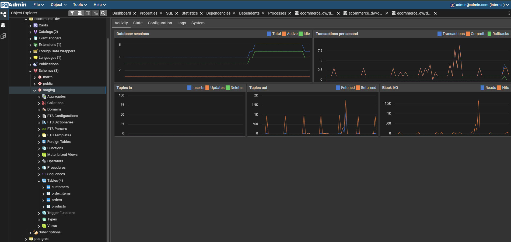
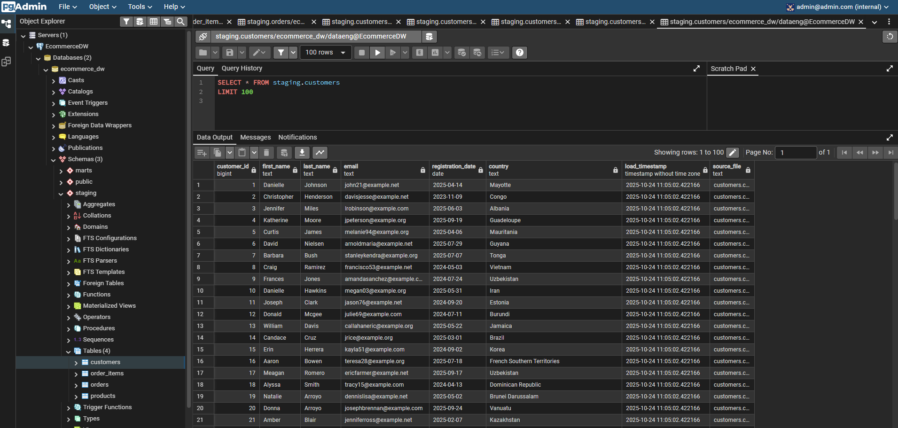

# ecommerce-data-pipeline
End-to-end data engineering project with ETL pipeline, data warehouse, and analytics

# 🛍️ E-Commerce Analytics Data Pipeline


> A production-ready end-to-end data engineering project demonstrating ETL pipelines, data warehousing, and analytics using modern data stack technologies.

## 📋 Table of Contents
- [Overview](#overview)
- [Architecture](#architecture)
- [Features](#features)
- [Tech Stack](#tech-stack)
- [Quick Start](#quick-start)
- [Project Structure](#project-structure)
- [Data Model](#data-model)
- [Analytics](#analytics)
- [Testing](#testing)
- [Screenshots](#screenshots)
- [Future Enhancements](#future-enhancements)
- [Contributing](#contributing)
- [License](#license)

## 🎯 Overview

This project implements a complete data engineering pipeline for an e-commerce analytics platform. It demonstrates:

- **ETL/ELT Processes**: Extracting data from CSV sources, transforming using SQL and Python
- **Data Warehousing**: Dimensional modeling with star schema (fact and dimension tables)
- **Data Quality**: Automated testing and validation
- **Analytics**: Interactive dashboards and business intelligence queries
- **Best Practices**: Version control, documentation, containerization, and CI/CD

**Perfect for**: Data Engineering portfolios, learning dimensional modeling, practicing SQL, and understanding modern data stacks.

## 🏗️ Architecture

┌─────────────────┐
│  CSV Data Files │
└────────┬────────┘
│
▼
┌─────────────────┐       ┌──────────────┐
│  Python ETL     │──────▶│  PostgreSQL  │
│  (src/loaders)  │       │   (Staging)  │
└─────────────────┘       └──────┬───────┘
│
▼
┌────────────────┐
│  Transform      │
│  (dimensions +  │
│   facts)        │
└────────┬───────┘
│
▼
┌────────────────┐
│  Data Warehouse │
│  (Star Schema)  │
└────────┬───────┘
│
┌─────────────┼─────────────┐
▼             ▼             ▼
┌─────────┐   ┌─────────┐  ┌──────────┐
│   SQL   │   │Streamlit│  │ PgAdmin  │
│ Queries │   │Dashboard│  │   UI     │
└─────────┘   └─────────┘  └──────────┘

## ✨ Features

- ✅ **Complete ETL Pipeline**: Automated data extraction, transformation, and loading
- ✅ **Star Schema Data Warehouse**: Optimized for analytics queries
- ✅ **Data Quality Tests**: Automated validation using pytest
- ✅ **Interactive Dashboard**: Real-time analytics with Streamlit
- ✅ **Docker Containerization**: Easy deployment and reproducibility
- ✅ **Sample Data Generator**: Faker-based realistic e-commerce data
- ✅ **10+ Business Analytics Queries**: Revenue, customers, products, trends
- ✅ **Professional Documentation**: Comprehensive README and code comments

## 🛠️ Tech Stack

| Component | Technology |
|-----------|------------|
| **Language** | Python 3.9+ |
| **Database** | PostgreSQL 15 |
| **Containerization** | Docker, Docker Compose |
| **Data Processing** | Pandas, NumPy |
| **Database ORM** | SQLAlchemy |
| **Testing** | Pytest |
| **Dashboard** | Streamlit, Plotly |
| **Data Generation** | Faker |
| **Version Control** | Git, GitHub |

## 🚀 Quick Start

### Prerequisites

- Python 3.9+
- Docker Desktop
- Git

### Installation
```bash
# 1. Clone the repository
git clone https://github.com/YOUR_USERNAME/ecommerce-data-pipeline.git
cd ecommerce-data-pipeline

# 2. Create virtual environment
python -m venv venv
source venv/bin/activate  # On Windows: venv\Scripts\activate

# 3. Install dependencies
pip install -r requirements.txt

# 4. Start Docker containers
make start
# Or: docker-compose up -d

# 5. Generate sample data
make data
# Or: python -m src.utils.generate_sample_data

# 6. Run ETL pipeline
make pipeline
# Or: python -m src.run_pipeline

# 7. Launch dashboard
make dashboard
# Or: streamlit run dashboards/ecommerce_dashboard.py
```

Visit:
- **Dashboard**: http://localhost:8501
- **PgAdmin**: http://localhost:5050 (admin@admin.com / admin)

## 📁 Project Structure

ecommerce-data-pipeline/
│
├── airflow/                 # Airflow DAGs (future enhancement)
├── dashboards/              # Streamlit dashboards
│   └── ecommerce_dashboard.py
├── data/
│   ├── raw/                # Raw data files
│   ├── processed/          # Processed data
│   └── sample/             # Generated sample data
├── dbt/                    # DBT models (future enhancement)
├── docker/
│   └── docker-compose.yml  # Container orchestration
├── docs/                   # Additional documentation
├── sql/
│   ├── ddl/               # Data Definition Language scripts
│   │   ├── 01_create_schemas.sql
│   │   ├── 02_create_staging_tables.sql
│   │   └── 03_create_marts_tables.sql
│   └── queries/           # Analytics queries
│       └── business_analytics.sql
├── src/
│   ├── extractors/        # Data extraction modules
│   ├── loaders/           # Data loading modules
│   │   └── csv_to_postgres.py
│   ├── transformers/      # Data transformation modules
│   │   ├── load_dimensions.py
│   │   └── load_facts.py
│   ├── utils/             # Utility functions
│   │   ├── config.py
│   │   ├── db_connection.py
│   │   ├── generate_sample_data.py
│   │   └── run_analytics.py
│   └── run_pipeline.py    # Main ETL orchestrator
├── tests/
│   ├── unit/              # Unit tests
│   └── integration/       # Integration tests
├── .env                   # Environment variables (not in repo)
├── .gitignore
├── docker-compose.yml
├── Makefile              # Convenient commands
├── pytest.ini            # Pytest configuration
├── README.md
└── requirements.txt

## 📊 Data Model

### Star Schema Design

**Dimension Tables:**
- `dim_customers` - Customer information and segmentation
- `dim_products` - Product catalog with pricing
- `dim_date` - Date dimension for time-based analysis

**Fact Tables:**
- `fact_orders` - Order-level metrics (revenue, profit, items)
- `fact_order_items` - Line-item level details

### Entity Relationship Diagram

┌─────────────────┐
│  dim_customers  │
│─────────────────│
│ customer_key PK │
│ customer_id     │
│ full_name       │
│ email           │
│ country         │
│ segment         │
└────────┬────────┘
│
│ 1:N
│
┌────────▼────────┐     ┌─────────────────┐
│  fact_orders    │  N:1│   dim_date      │
│─────────────────│◄────│─────────────────│
│ order_key    PK │     │ date_key     PK │
│ customer_key FK │     │ date            │
│ date_key     FK │     │ year, month     │
│ total_amount    │     │ quarter, week   │
│ profit          │     └─────────────────┘
└────────┬────────┘
│
│ 1:N
│
┌────────▼──────────┐    ┌─────────────────┐
│ fact_order_items  │ N:1│  dim_products   │
│───────────────────│◄───│─────────────────│
│ item_key      PK  │    │ product_key  PK │
│ order_key     FK  │    │ product_id      │
│ product_key   FK  │    │ product_name    │
│ quantity          │    │ category        │
│ total_price       │    │ price, cost     │
└───────────────────┘    └─────────────────┘

## 📈 Analytics

The project includes 10+ pre-built analytics queries:

1. **Sales Overview** - KPIs for revenue, orders, customers
2. **Daily Sales Trend** - Time-series analysis
3. **Top Customers** - Customer lifetime value
4. **Product Performance** - Revenue by category/product
5. **Customer Segmentation** - Loyal vs New customers
6. **Monthly Trends** - Month-over-month growth
7. **Order Status Distribution** - Completion rates
8. **Weekend vs Weekday** - Day-of-week patterns
9. **Geographic Analysis** - Revenue by country
10. **Cohort Analysis** - Customer retention

## 🧪 Testing
```bash
# Run all tests
make test

# Run with coverage
make test-coverage

# Unit tests only
make test-unit

# Integration tests only
make test-integration
```

**Test Coverage:**
- Unit tests for data generators and utilities
- Integration tests for database connections and data quality
- Data validation tests for schema and relationships
- End-to-end pipeline tests

## 📸 Screenshots

### Interactive Dashboard


### Data Model in PgAdmin


### ETL Pipeline Execution


## 🔧 Available Commands
```bash
make help         # Show all available commands
make start        # Start Docker containers
make stop         # Stop Docker containers
make data         # Generate sample data
make pipeline     # Run complete ETL pipeline
make dashboard    # Launch Streamlit dashboard
make analytics    # Run analytics queries
make test         # Run all tests
make clean        # Clean data and restart
```

## 🎓 Skills Demonstrated

This project showcases the following data engineering skills:

### Technical Skills
- **Python Programming**: OOP, pandas, SQLAlchemy, async processing
- **SQL Mastery**: DDL, DML, CTEs, window functions, complex joins
- **Database Design**: Star schema, normalization, indexing
- **ETL/ELT**: Data extraction, transformation, loading patterns
- **Data Modeling**: Dimensional modeling, slowly changing dimensions
- **Testing**: Unit tests, integration tests, data quality validation
- **Version Control**: Git workflows, branching, documentation

### Tools & Technologies
- **Databases**: PostgreSQL, SQL optimization
- **Containerization**: Docker, Docker Compose
- **Orchestration**: Python scripts (extensible to Airflow)
- **Visualization**: Streamlit, Plotly
- **Data Generation**: Faker for realistic test data
- **CI/CD**: GitHub Actions (future enhancement)

### Best Practices
- ✅ Clean, modular code architecture
- ✅ Comprehensive documentation
- ✅ Automated testing
- ✅ Error handling and logging
- ✅ Configuration management
- ✅ Database migrations and version control
- ✅ Reproducible environments

## 🔮 Future Enhancements

### Phase 1 (Planned)
- [ ] Apache Airflow DAGs for orchestration
- [ ] DBT for transformations
- [ ] GitHub Actions CI/CD pipeline
- [ ] Data lineage tracking
- [ ] Monitoring and alerting

### Phase 2 (Roadmap)
- [ ] Real-time streaming with Apache Kafka
- [ ] Cloud deployment (AWS/GCP/Azure)
- [ ] Data catalog integration (DataHub/Amundsen)
- [ ] ML model serving pipeline
- [ ] Advanced analytics (cohort analysis, forecasting)
- [ ] API layer with FastAPI

### Phase 3 (Ideas)
- [ ] Multi-source ingestion (APIs, databases)
- [ ] Incremental loading strategies
- [ ] Data versioning and time travel
- [ ] Cost optimization dashboard
- [ ] Multi-tenant architecture

## 🤝 Contributing

Contributions are welcome! Please feel free to submit a Pull Request.

1. Fork the repository
2. Create your feature branch (`git checkout -b feature/AmazingFeature`)
3. Commit your changes (`git commit -m 'Add some AmazingFeature'`)
4. Push to the branch (`git push origin feature/AmazingFeature`)
5. Open a Pull Request

## 📝 License

This project is licensed under the MIT License - see the [LICENSE](LICENSE) file for details.

## 👤 Author

**Your Name**
- GitHub: [@yourusername](https://github.com/yourusername)
- LinkedIn: [your-linkedin](https://linkedin.com/in/your-profile)
- Email: your.email@example.com

## 🙏 Acknowledgments

- Inspired by real-world data engineering challenges
- Built as a learning project and portfolio piece
- Thanks to the open-source community for amazing tools

## 📚 Resources

- [PostgreSQL Documentation](https://www.postgresql.org/docs/)
- [Streamlit Documentation](https://docs.streamlit.io/)
- [SQLAlchemy Documentation](https://docs.sqlalchemy.org/)
- [Docker Documentation](https://docs.docker.com/)
- [Data Warehouse Toolkit by Kimball](https://www.kimballgroup.com/)

---

⭐ **If you found this project helpful, please star the repository!**

Made with ❤️ for the Data Engineering community